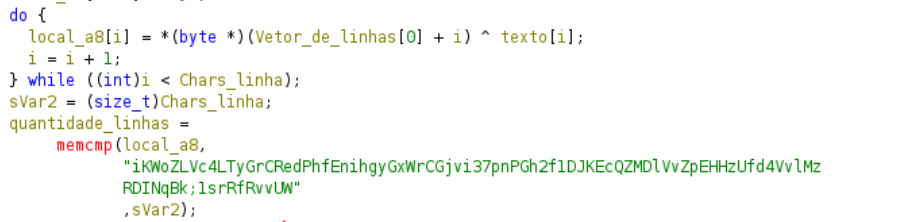
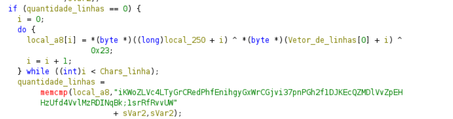
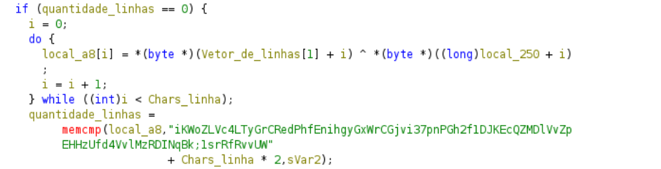
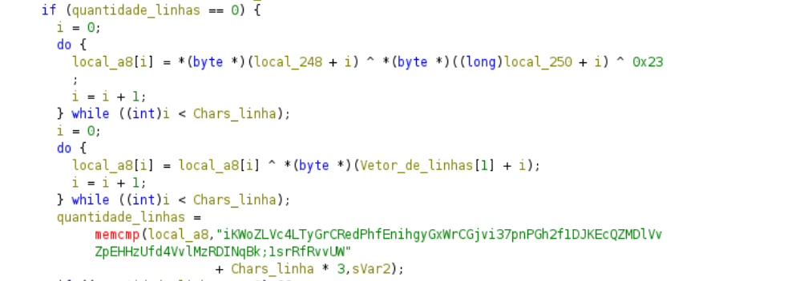
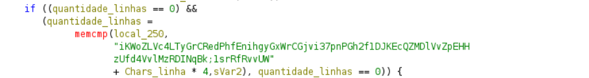

# ASISCTFFINALS2015 License
- Desafio de Rev, do estilo flag checker.
Disas da main:


Escreve o nome "*a\nb\tc*" no rdi -> posteriormente usado como parâmetro da função fopen

```bash
hexdump -ve '1/1 "%.2X"' license | sed 's/5F610A6209635F/4d415449415321/g' | xxd -r -p > license_novo
```

Agora criamos um arquivo chamado 'MATIAS!'

e temos o erro: 
```
wrong formated key file
```
e não:
```
key file not found!
```


descobrimos assim que o número de caracteres em cada uma das linhas deve ser 6

${{34 - (5 - 1) }\over 5} = 6$

Portanto: o arquivo MATIAS! deve ter a seguinte estrutura:

AAAAAA\n
BBBBBB\n
CCCCCC\n
DDDDDD\n
EEEEEE


A variável vetor_de_linhas guarda o ponteiro para cada uma das linhas a partir da segunda
exemplo:
Vetor_de_linhas = [B,C,D,E]


A primeira verificação:
- xor entre a primeira linha "texto" e "Vetor_de_linhas[0]"
- Compara o resultado da operação com os 6 primeiro bytes da string em verde
portanto: l1 ^ l2 = iKWoZL

A segunda verificação:


-  local250 uma variável até então não utilizada, a segunda linha de novo e 0x23
- compara com a string Vc4LTy
portanto: local250 ^ l2 ^ 0x23 = Vc4LTy

Terceira verificação:


- local 250 de novo e a linha numero 3 agora
portanto: local250 ^ l3 = GrCRed

Quarta Verificação:


- Local248 mais uma variável nova, local250 e 0x23, e diferente das outras ele não verifica logo em seguida. Ele conecta em outro XOR.
- portanto (local248 ^ local250 ^ 0x23) ^ l3 = PhfEni

Quinta e ultima verificação:

- Agora ele apenas compara a variável local250 com a string "hgyGxW" formando assim a nossa linha 4.
Com isso temos as seguintes equações:
- l1 ^ l2 = iKWoZL
- l2 ^ l4 ^ 0x23 = Vc4LTy
 - l3 ^ l4 = GrCRed
 - (x ^ l4 ^ 0x23) ^ l3 = PhfEni
 - l4 = hgyGxW
Considerando que temos 5 linhas no arquivo chave, assumimos x como l5.
Com isso podemos utilizar um script em python para resolver as equações e gerar nosso arquivo chave "MATIAS!"

```
from pwn import *

answer = "iKWoZLVc4LTyGrCRedPhfEnihgyGxWrCGjvi37pnPGh2f1DJKEcQZMDlVvZpEHHzU"
answer = answer.encode()
a4 = answer[24:30]
a2 = xor(xor(a4, chr(0x23)*6), answer[6:12])
a1 = xor(answer[0:6], a2)
a3 = xor(answer[12:18], a4)
a5 = xor(xor(xor(answer[18:24], a3), a4), chr(0x23)*6)

# Convert to strings and write in text mode
with open("MATIAS!", "w") as f:
    lines = [a1.decode() + "\n", a2.decode() + "\n", a3.decode() + "\n", a4.decode() + "\n", a5.decode()]
    f.writelines(lines)
```

Com isso, ao rodar o license_novo:
```bash
program successfully registered to ASIS{8d2cc30143831881f94cb05dcf0b83e0}
```
