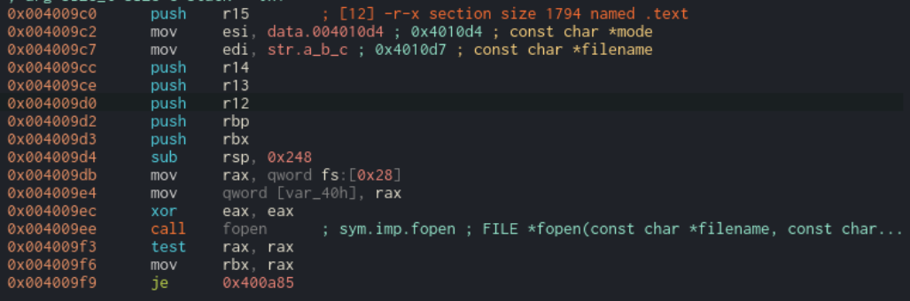
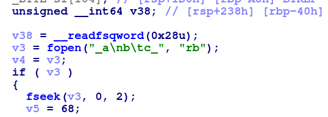
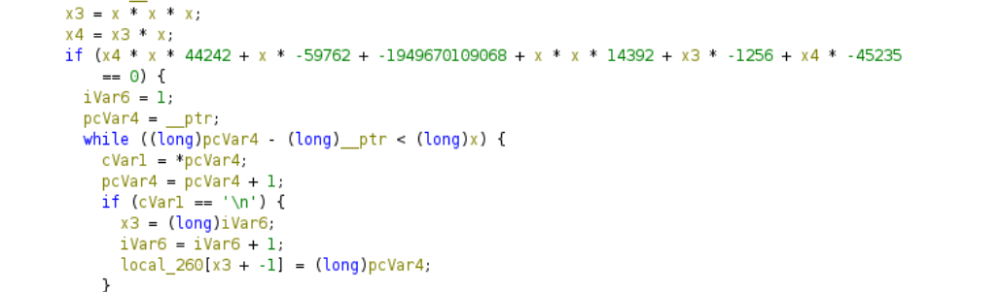
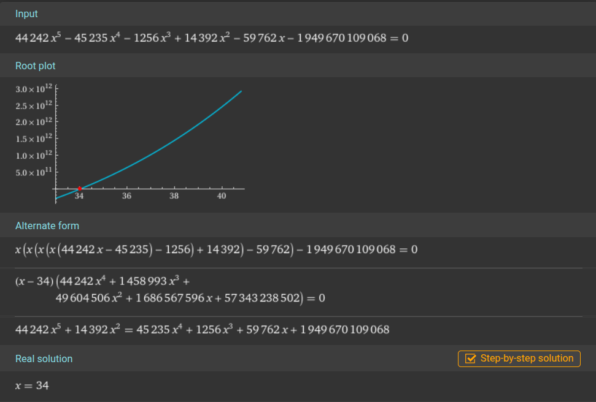
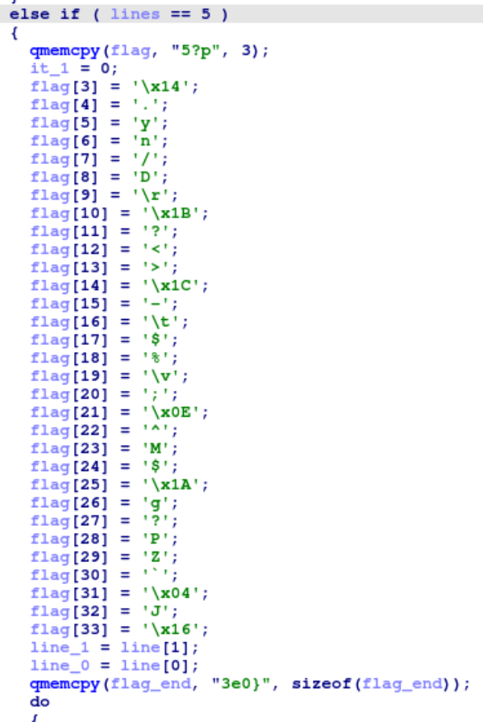
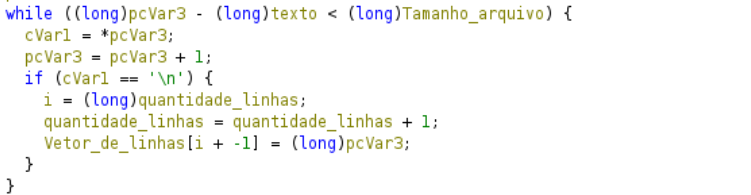
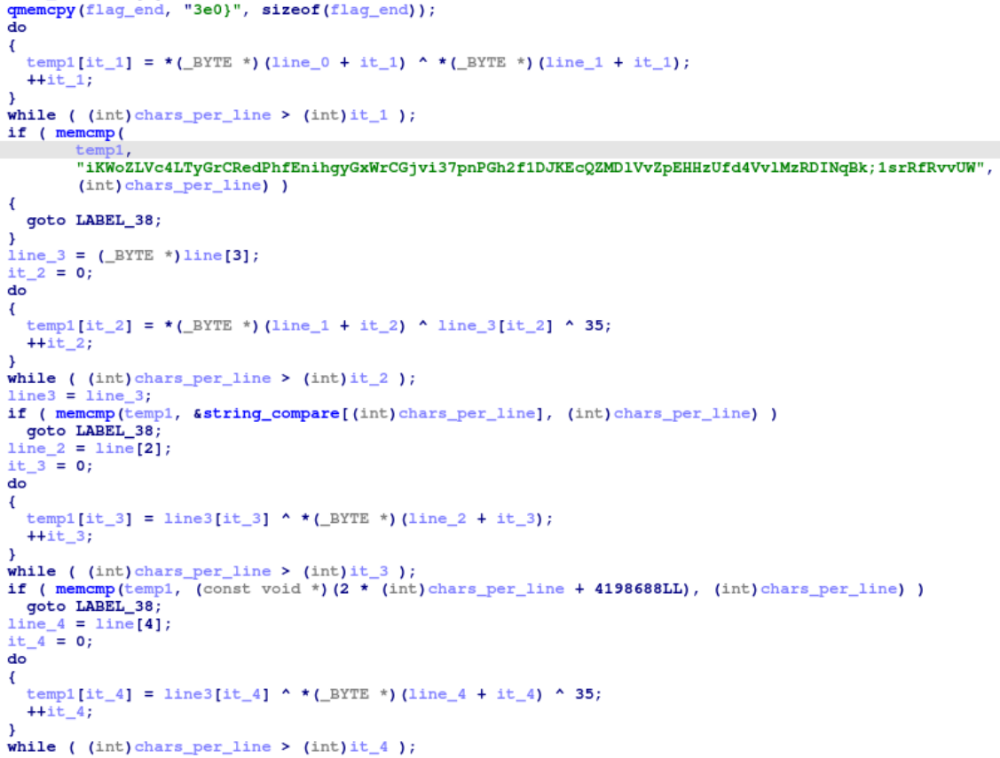
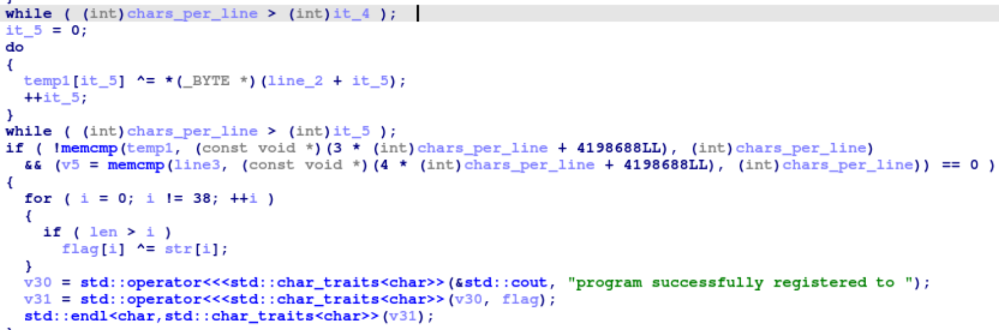

# Reverse Engineering

## License

>### ASIS 2015 Finals
>#### https://github.com/angr/angr-examples/tree/master/examples/asisctffinals2015_license

Esse é o write-up do desafio License, do ASIS 2015 Finals.

## Scripts de Resolução

Temos 2 scripts:
- O `solve_angr.py` que utiliza o angr para a resolução e já imprime no final a flag;
- E o script `generate_keyfile.py` que gera o arquivo necessário para rodar o binário após realizar o seu patch como mostraremos a seguir.

## Análise Estática do Binário

Temos o binário license que, ao rodarmos, mostra a seguinte saída:

`key file not found!`

No disassembly da função main encontramos um arquivo que é aberto pelo binário:



A análise estática revelou que ele tenta abrir esse arquivo cujo nome é literalmente: `_a\nb\tc_` (ou seja, contém caracteres especiais \n e \t no nome):



Optamos por modificar o próprio binário para que ele procurasse por outro nome de arquivo mais simples - neste caso "MATIAS!" - usando uma substituição via hexdump:

```bash
hexdump -ve '1/1 "%.2X"' license | sed 's/5F610A6209635F/4d415449415321/g' | xxd -r -p > license_novo
```

Agora criamos um arquivo chamado 'MATIAS!' e temos o erro: 

`wrong formated key file`

Continuando, encontramos a condição de que o tamanho do arquivo deve ser 34 bytes (através da resolução de um sistema):





Além disso, podemos ver a flag encriptada e que o número de linhas do arquivo deve ser obrigatoriamente igual a 5: 



Com isso, descobrimos que o número de caracteres em cada uma das linhas (excluindo os "\n") deve ser igual a 6:


${{34 - (5 - 1) }\over 5} = 6$

Portanto, o arquivo "MATIAS!" deve ter a seguinte estrutura:

```bash
AAAAAA\n
BBBBBB\n
CCCCCC\n
DDDDDD\n
EEEEEE
```

A variável vetor_de_linhas (chamada de line_0, line_1, etc. nas próximas imagens em outro software) guarda o ponteiro para cada uma das linhas a partir da segunda (line_0 se refere à segunda linha, ... e line_3 à quinta linha):



Após isso, podemos visualizar 5 equações com operações do tipo XOR:





A primeira verificação:

- XOR entre a primeira linha e a segunda linha.
- Compara o resultado da operação com os 6 primeiro bytes da string em verde.

Logo, `l1 ^ l2 = "iKWoZL"`

A segunda verificação:

- XOR entre a segunda linha, a quarta linha e 35 em decimal (XOR é realizado caracter a caracter).
- Compara os 6 bytes da string a partir do byte 6.

Ou seja, `l2 ^ l4 ^ 35 = "Vc4LTy"`

Terceira verificação:

- XOR entre a quarta linha e a terceira linha.
- Compara os 6 bytes da string a partir do byte 12 (o valor `4198688LL` se refere à string).

Portanto, `l4 ^ l3 = "GrCRed"`

Quarta Verificação:

- XOR entre a quinta linha, a quarta linha e 35 em decimal. Logo em seguida, esse resultado realiza outro XOR com a linha 3.
- Compara os 6 bytes da string a partir do byte 18.

Assim, `(l5 ^ l4 ^ 35) ^ l3 = "PhfEni"`

Quinta e ultima verificação:

- Agora ele apenas compara a quarta linha com a string "hgyGxW".

Com isso temos as seguintes equações:

```bash
linha_1 ^ linha_2 = "iKWoZL"
linha_2 ^ linha_4 ^ 35 = "Vc4LTy"
linha_4 ^ linha_3 = "GrCRed"
linha_5 ^ linha_4 ^ 35 ^ linha_3 = "PhfEni"
linha_4 = "hgyGxW"
```

A partir desse sistema, conseguimos reconstruir as 5 linhas do arquivo original (feito através do script `create_keyfile.py`) e com isso falta apenas executar o binário após o patch e ele imprimirá a flag, a qual é encontrada ao realizar a operação XOR da flag encriptada com o conteúdo do arquivo original e somando os últimos 4 bytes restantes no final.

## Flag

```bash
./license_novo
program successfully registered to ASIS{8d2cc30143831881f94cb05dcf0b83e0}
```